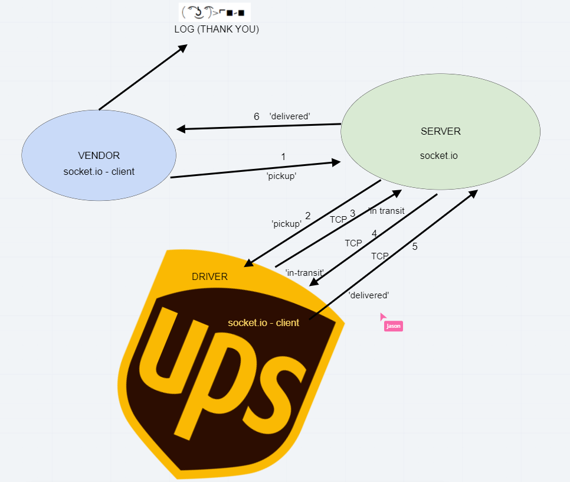

# Caps

# Codefellows Lab 12 - Socket.io

# Overview

- In Phase 2, we’ll be changing the underlying networking implementation of our CAPS system from using node events to using a library called socket.io so that we can do networked events. Socket.io manages the connection pool for us, makes broadcasting much easier to operate, and works well both on the terminal (between servers) and with web clients.

- The core functionality we’ve already built remains the same. The difference in this phase is that we’ll be creating a networking layer. As such, the user stories that speak to application functionality remain unchanged, but a new set theme emerges to get us through the refactoring.

    - As a vendor, I want to alert the system when I have a package to be picked up
    - As a driver, I want to be notified when there is a package to be delivered
    - As a driver, I want to alert the system when I have picked up a package and it is in transit
    - As a driver, I want to alert the system when a package has been delivered
    - As a vendor, I want to be notified when my package has been delivered
    - And as developers, here are some of the development stories that are relevant to the above

        - As a developer, I want to create network event driven system using Socket.io so that I can write code that responds to events originating from both servers and web applications

# UML

# Instructions
- Clone Repo
    - NPM install in each subdirectory (driver, server, vendor)
    - Run npm (<filename>.js) for each subdirectory to run demo app

### Resources
* Collaborated with: Carly Dekock, Jason Quaglia, Jason Dormier, William Moreno, Seid MO